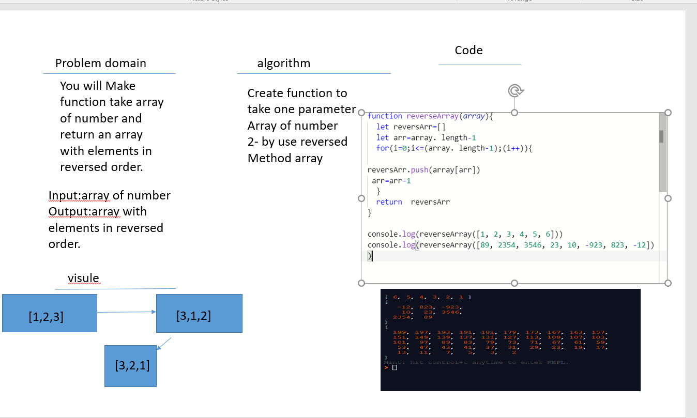

# Data Structures and Algorithms

# Reverse an Array

The reverse() method reverses an array in place. The first array element becomes the last, and the last array element becomes the first.

## Challenge
You will Make function take array of number and return an array with elements in reversed order.

## Approach & Efficiency

Create function to take one parameter
Array of number 
2- by use reversed 
Method array 
because it is easy way to solve this challange 

## Solution

 

